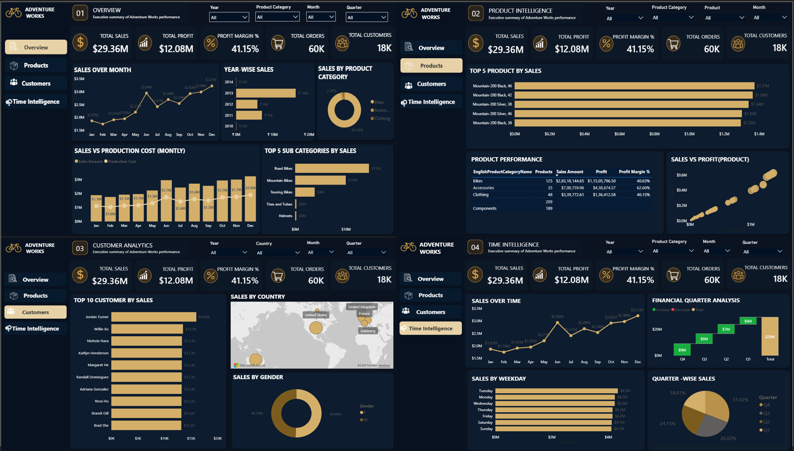

# 📊 AdventureWorks Sales Dashboard | Power BI

## Overview

This project is a multi-page Power BI dashboard built using the AdventureWorks dataset.

The dashboard provides business insights through Sales Analysis, Product Intelligence, Customer Analytics, and Time Intelligence.

---

## Dashboard Preview



## Tools Used

- Power BI
- DAX
- Power Query
- Data Modeling
- Interactive Visualizations

---

## Dashboard Pages

### 1️⃣ Overview Dashboard
- Total Sales
- Total Profit
- Production Cost
- Profit Margin %
- Total Orders

### 2️⃣ Product Intelligence
- Top Products by Sales
- Product Performance
- Sales vs Profit Analysis

### 3️⃣ Customer Analytics
- Top Customers
- Sales by Country
- Customer Insights

### 4️⃣ Time Intelligence
- Sales Trends
- Quarterly Analysis
- Weekday Analysis

---

## Dashboard Features

- Interactive Filters
- KPI Cards
- Page Navigation
- Dynamic Visualizations
- DAX Measures
- Time Intelligence Analysis
- Customer Analytics
- Product Analytics

---

## Project Structure

```text
Dashboard/
   Adventure Work_Powerbi_Dashboard.pbix

Images/
   overview-dashboard.png
   product-intelligence.png
   customer-analytics.png
   time-intelligence.png
```

## Author

**Deeksha Poojary**

Aspiring Data Analyst

LinkedIn:
https://www.linkedin.com/in/deeksha-poojary-584423230/

GitHub:
https://github.com/Deekshapoojary
